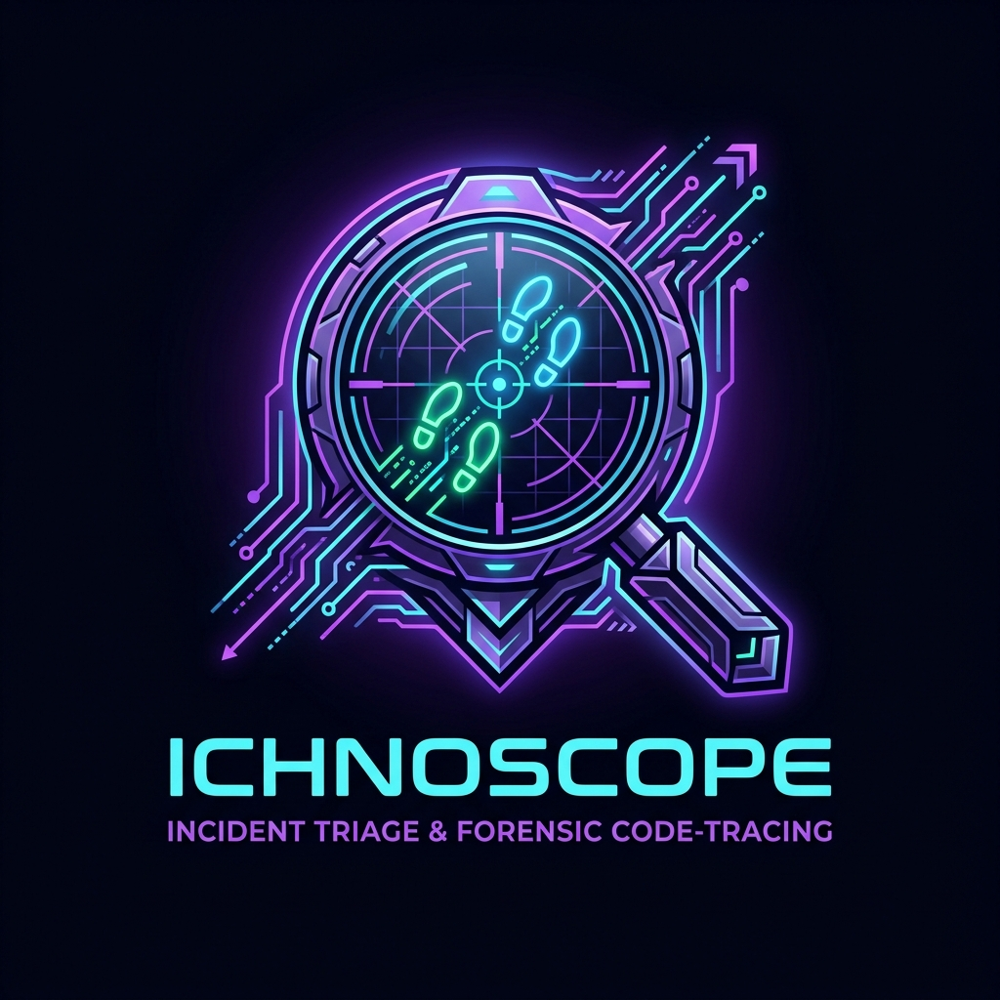
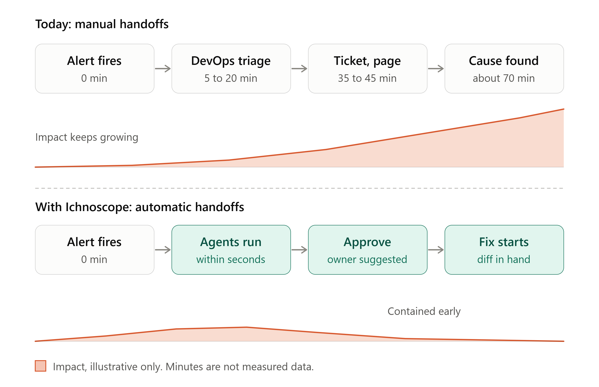
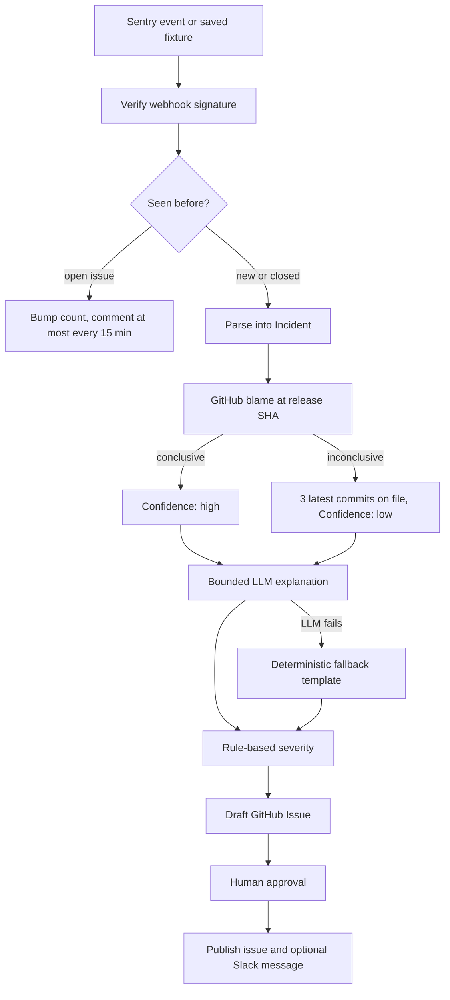
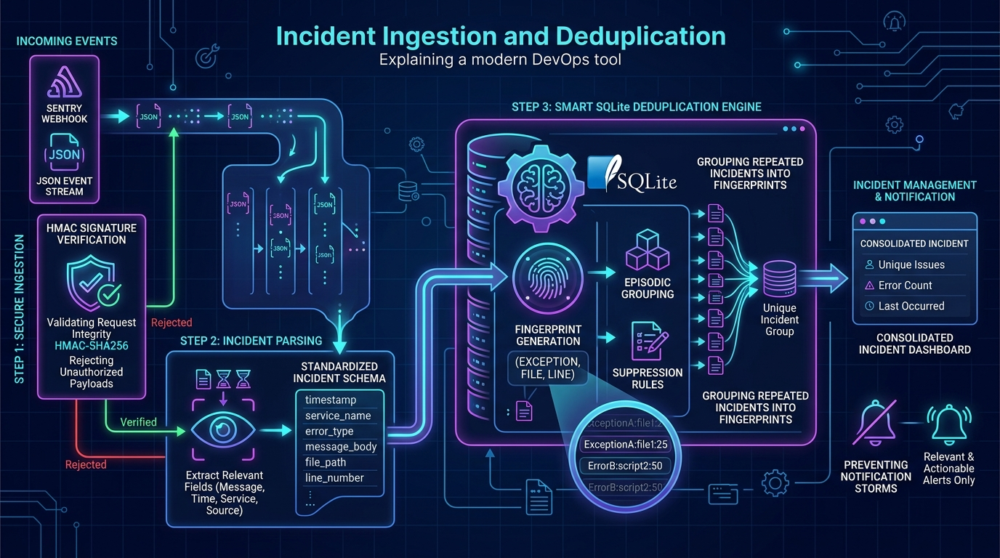
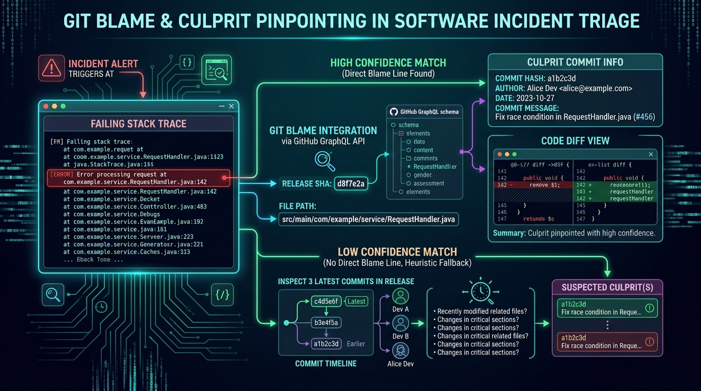
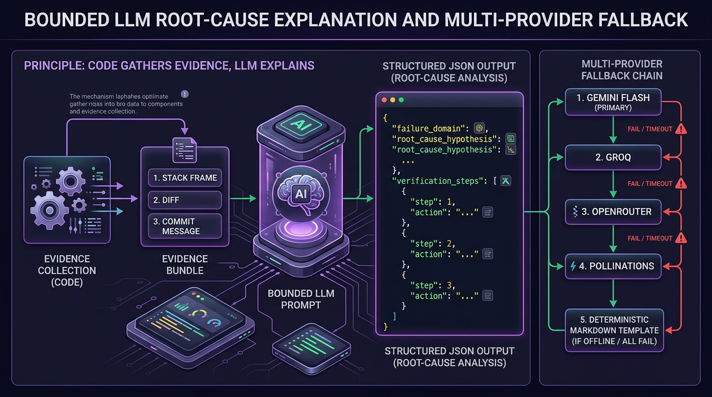
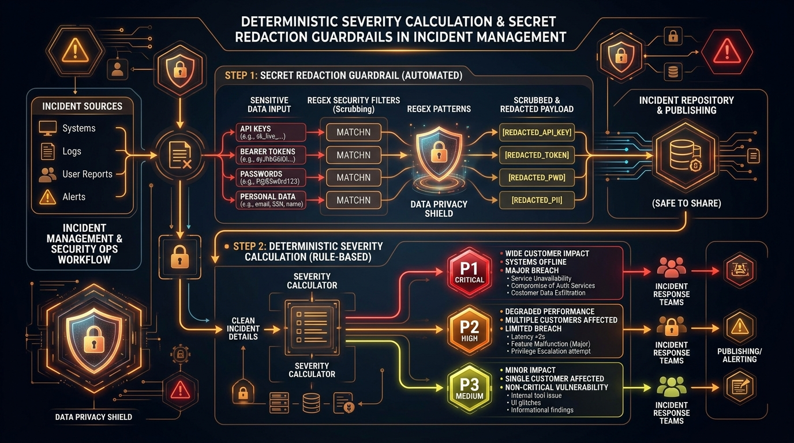
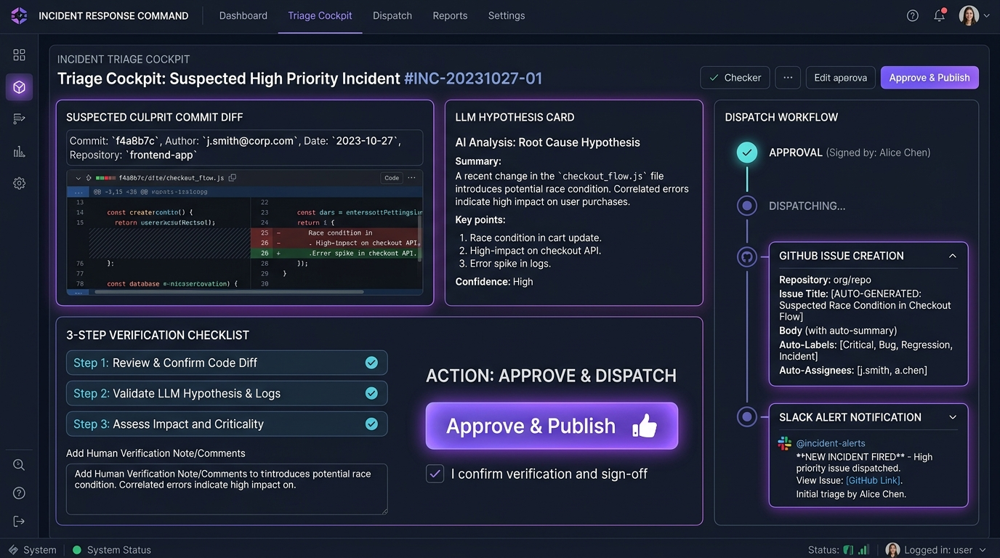

<p align="center">
  
</p>

<h3 align="center">Evidence-driven incident triage for modern software teams</h3>

<p align="center">
  Sentry &rarr; GitHub Blame &rarr; Root-Cause Explanation &rarr; Severity &rarr; Actionable Issue
</p>

<p align="center">
  
  
  
  
  
</p>

<p align="center">
  <a href="https://ichnoscope-wcc-30.vercel.app/">
    
  </a>
  &nbsp;
  <a href="https://www.youtube.com/watch?v=NsmXi0lnl7Y">
    
  </a>
</p>

<p align="center">
  <a href="#-demo">Demo</a> &middot;
  <a href="#the-problem">Problem</a> &middot;
  <a href="#how-it-works">How it works</a> &middot;
  <a href="#architecture">Architecture</a> &middot;
  <a href="#security-model">Security</a> &middot;
  <a href="#getting-started">Getting started</a> &middot;
  <a href="#project-status">Status</a> &middot;
  <a href="#roadmap">Roadmap</a>
</p>

---

## 🎬 Demo

> ### 🚀 Live deployment: **[ichnoscope-wcc-30.vercel.app](https://ichnoscope-wcc-30.vercel.app/)**
> ### 🚀 Demo website for trigering errors: **[https://ichnoscope-demo-we-app-1.onrender.com/](https://ichnoscope-demo-we-app-1.onrender.com/)**
> 
> ### ▶️ Video walkthrough: **[Watch on YouTube](https://www.youtube.com/watch?v=NsmXi0lnl7Y)**

<p align="center">
  <a href="https://www.youtube.com/watch?v=NsmXi0lnl7Y">
    
  </a>
  <br>
  <em>Click the thumbnail to watch the project explanation</em>
</p>

---

## The problem

When production breaks, the first part of the response usually goes to **assembling context**, not fixing the bug. An engineer reads the stack trace, finds the deployed version of the file, runs blame, finds the pull request, works out who owns it, and then writes the ticket. The information exists, but it is spread across monitoring, source control and ticketing tools.

<p align="center">
  
</p>

**Ichnoscope** connects that evidence into a single pipeline. It receives a Sentry error, finds the commit that last changed the failing line **in the deployed version**, asks an LLM to explain the likely failure from that evidence, and prepares an actionable GitHub Issue for the right person.

> **Code gathers evidence. The LLM explains it. Humans stay in control.**

The LLM never chooses the commit, the assignee or the severity. It receives a bounded evidence bundle and returns only a structured explanation and a three-step verification checklist.

### Goals

| Goal | Target |
| --- | --- |
| Time from error to actionable issue | Under 60 seconds (excluding LLM outages) |
| Correct commit and assignee | At least 8 of 10 planted bugs in the benchmark |
| One issue per distinct error | 50 identical events produce 1 issue |
| Safe failure | An issue is still created if the LLM is down |

### Non-goals

Ichnoscope does not push fixes, open fix PRs, roll back deployments, replace monitoring or alerting, or (in v1) support frontend source maps, Datadog or New Relic.

---

## How it works



### 1. Ingestion and deduplication

<p align="center">
  
</p>

Ichnoscope accepts a signed Sentry webhook, or replays a saved fixture for offline demos. Each incident gets a fingerprint built from the exception type, the repository-relative file path and the line number. Repeats of an open incident update the existing record instead of creating a new issue. If the earlier issue was closed, the new event is treated as a **regression**.

### 2. Git blame and suspect analysis

<p align="center">
  
</p>

This is the core evidence step, and the key detail is that blame runs **at the release SHA**. The line number in a production stack trace belongs to the deployed file. Blaming the current branch, or searching recent diffs, can point at the wrong commit once later edits shift the lines.

1. Read the failing file and line from the incident.
2. Query GitHub GraphQL blame at the release SHA.
3. Identify the commit that owns that line and fetch its diff (truncated to about 6 KB).
4. Resolve the pull-request author when there is one.
5. Mark the result `high` confidence when blame is conclusive.

If blame is inconclusive (missing release, renamed file, API failure), Ichnoscope falls back to the three latest commits on the file and marks the result `low` confidence. It also records whether the change landed within the configured window (default 24 hours), so the issue can say whether it is a **recent regression** or **old code triggered by new data**.

Ichnoscope reports a **suspect**, not a proven culprit. Blame shows who last touched a line, not who is at fault.

### 3. Bounded LLM explanation

<p align="center">
  
</p>

The model receives one evidence bundle (incident fields, the suspect commit and diff, and up to two other recent commits on the file), wrapped in `<evidence>` tags and truncated to a fixed budget. It returns a single structured object:

| The LLM produces | The LLM never decides |
| --- | --- |
| Domain (`backend`, `frontend`, `database`, `infra`) | Commit SHA |
| A 2 to 4 sentence root-cause hypothesis | GitHub username or assignee |
| Exactly three verification steps | Severity |
| | Whether code should change |

**Provider fallback.** The explanation layer is one logical call that can fail over between providers. If every provider fails or returns invalid output, a deterministic template is used and the issue is still created.

```text
Gemini  ->  Groq  ->  OpenRouter  ->  Pollinations  ->  deterministic fallback template
```

### 4. Severity and secret redaction

<p align="center">
  
</p>

Severity comes from rules, not from the model. The thresholds are defaults and are configurable.

| Condition | Severity |
| --- | --- |
| Production and at least 50 users or 100 events | `P1-Critical` |
| Production and at least 10 users or 20 events | `P2-High` |
| Anything else | `P3-Medium` |

Before anything is posted externally, stack traces and diffs are scanned and redacted for API keys, bearer tokens, passwords and email addresses.

### 5. Human review and dispatch

<p align="center">
  
</p>

Ichnoscope is a triage assistant, not an auto-remediation system. In the dashboard workflow the pipeline stores the issue as a **draft**, and an administrator reviews the suspect commit, diff, hypothesis, checklist, severity, suggested owner and confidence before approving or rejecting it. Approval can be switched off for fully automatic operation.

It never modifies source code, opens fix PRs, deploys changes or rolls anything back.

---

## Architecture

```text
 Sentry / fixture
        |
        v
    Gateway ---> Dedupe ---> Parse ---> Blame ---------> GitHub GraphQL + REST
                                          |
                                          v
                                       Explain ---------> LLM providers
                                          |
                                          v
                                      Severity ---> Dispatch ---> GitHub Issues
                                                        |
                                                        +-------> Slack (optional)
```

| Component | Responsibility | Deterministic |
| --- | --- | --- |
| Gateway | Verify signature, reply `200`, start a background run | Yes |
| Dedupe | Claim the fingerprint, suppress repeats, detect regressions | Yes |
| Parse | Sentry JSON to `Incident` (last `in_app` frame, path-prefix mapping) | Yes |
| Blame | Find the commit that owns the failing line at the release SHA | Yes |
| Explain | Domain, hypothesis and checklist | **No (one bounded LLM call)** |
| Severity | P1, P2 or P3 from numbers | Yes |
| Dispatch | Draft, approve and publish the issue, notify Slack | Yes |

### Planned dashboard deployment

```text
 Next.js dashboard (Vercel)  --->  FastAPI backend (Python host)  --->  PostgreSQL
   server routes hold the            pipeline, publisher,              runs, run_logs,
   admin token, never the            /webhook/sentry (HMAC)            settings, repos, seen
   browser                           /api/* (admin token)
```

The dashboard polls run logs every few seconds instead of using websockets. GitHub and LLM credentials live only in the backend environment and are never exposed to the browser.

### Design decisions

| Decision | Alternative rejected | Reason |
| --- | --- | --- |
| Blame at the release SHA | Match the line against recent diff hunks | Hunk line numbers shift after later edits |
| LLM outputs only an explanation | LLM picks commit, assignee and severity | Removes hallucinated identities |
| Rule-based severity | LLM severity | Reproducible, explainable, tunable |
| One issue per fingerprint, comment on repeats | One issue per alert | Prevents alert storms |
| SQLite for the MVP, Postgres for the dashboard | Redis or in-memory cache | No extra infrastructure; the unique key acts as a lock |
| Plain functions (LangGraph optional) | Mandatory workflow engine | The flow is linear with two guarded branches |
| "Suspect", not "culprit" | Assertive blame | Blame is evidence, not proof |
| Draft then approve | Always auto-publish | A human checks the suggested owner first |

---

## Failure handling

Every failure path degrades to a simpler issue instead of silence.

| Failure | Behaviour |
| --- | --- |
| GitHub 5xx or rate limit | Retry with backoff, then a minimal issue marked `low-confidence` |
| Blame inconclusive | Use the 3 latest commits on the file and mark `low-confidence` |
| Author has no GitHub login, or is not assignable | Assign `FALLBACK_ASSIGNEE` |
| LLM error or invalid output | Use the fallback template; the issue is still created |
| Slack unavailable | Log and continue |
| Sentry retries the webhook | Idempotent through the fingerprint claim |
| Closed issue receives the same fingerprint | New issue labelled `regression` |
| Process crash mid-run | A row without an issue older than 5 minutes is re-run on the next event |

---

## Security model

| Threat | Control |
| --- | --- |
| Forged webhook creates issues | HMAC-SHA256 signature check with constant-time comparison; `401` on mismatch |
| Prompt injection through error text, stack or commit messages | Evidence wrapped in `<evidence>` tags and treated as data; the LLM has **no tools and no write access**, so a hijacked model can only change issue text |
| Secrets pasted into issues or Slack | Regex redaction on diffs and stacks before posting |
| Token over-reach | Fine-grained GitHub token scoped to one repository |
| Issue spam | Deduplication plus at most one comment per 15 minutes per fingerprint |
| Open dashboard | Password gate on pages and an admin token on every `/api/*` call |
| Sensitive code in public repositories | Run on private repositories only |

---

## Example generated issue

````markdown
## [Auto-triage] KeyError: 'stripe_token'

**Severity:** P2-High  **Domain:** `backend`  **Confidence:** high
**Failing line:** `services/payment.py:84`
**Suspect:** @example-dev via a1b2c3d (PR #41)
**Last changed:** 20 minutes ago (recent change, likely regression)

### Why it probably failed
The suspect commit replaced a safe lookup with a direct key access, so requests
without a token now raise instead of returning a clean error.

### Suspect change
```diff
-    token = payload.get("stripe_token")
+    token = payload["stripe_token"]
```

### Verification checklist
- [ ] Send a checkout request with no `stripe_token` and confirm the exception
- [ ] Check whether any client legitimately omits the token
- [ ] Restore the guarded lookup and add a regression test
````

---

## Getting started

> The repository is currently a documentation and scaffold state (see [Project status](#project-status)). The steps below describe the intended setup. To see the project in action right now, use the [live demo](https://ichnoscope-wcc-30.vercel.app/) or [watch the video](https://www.youtube.com/watch?v=NsmXi0lnl7Y).

```bash
git clone https://github.com/<owner>/Ichnoscope-WCC-30.git
cd Ichnoscope-WCC-30/backend
python -m venv .venv && source .venv/bin/activate
pip install -r requirements.txt
cp .env.example .env        # fill in the values below
python -m ichnoscope.replay fixtures/<payload>.json --dry-run
```

`--dry-run` prints the generated issue as Markdown and posts nothing, which is the safest way to try the pipeline.

### Configuration

| Variable | Required | Meaning |
| --- | --- | --- |
| `GITHUB_TOKEN` | Yes | Fine-grained token for one repository (Contents, Metadata, Pull requests read; Issues read/write) |
| `GITHUB_REPOSITORY` | Yes | `owner/repo` |
| `SENTRY_CLIENT_SECRET` | Yes | Key for webhook signature verification |
| `LLM_API_KEY`, `LLM_MODEL` | Yes | Provider credentials |
| `PATH_PREFIX_STRIP` | No | Maps container paths to repo paths, for example `/app/` |
| `FALLBACK_ASSIGNEE` | Recommended | Login used when blame yields no assignable user |
| `SLACK_WEBHOOK_URL` | No | Enables Slack notifications |
| `DRY_RUN` | No | `true` prints the issue and posts nothing |
| `WINDOW_HOURS` | No | Recent-change window, default 24 |
| `P1_USERS`, `P1_EVENTS`, `P2_USERS`, `P2_EVENTS` | No | Severity thresholds |

Never commit real credentials. For the dashboard deployment, provider keys and the admin token stay on the server side only.

---

## Validation and benchmarks

A demo repository (`ichnoscope-demo-app`) contains five planted bugs in commits by different authors, with a git history built to be reproducible and verified by script. The cases cover:

- a fresh regression where the file's latest commit differs from the blamed commit (decoy commit),
- a bug where blame points at the original line but the real cause is a later change,
- an author with no GitHub account (fallback-assignee path),
- older latent bugs triggered by new data.

| Metric | Target |
| --- | --- |
| Blame accuracy | At least 8 of 10 planted bugs (the benchmark set will grow beyond the first five) |
| Time to issue | Under 60 seconds, excluding LLM outages |
| Duplicate suppression | 50 events produce 1 issue |
| LLM failure | Issue still created |

Results will be recorded in `backend/bench/results.md` once the benchmark has run.

---

## Project status

| Area | State |
| --- | --- |
| Technical specification, architecture and diagrams | Done |
| Failure, security and fallback design | Done |
| Demo-repository design and build tooling | In progress |
| Backend pipeline (parse, blame, explain, dispatch) | Scaffold |
| Webhook gateway and deduplication | Planned |
| Next.js dashboard with draft and approve workflow | Planned |
| Postgres persistence and end-to-end deployment | Planned |

The original design is SQLite and backend-first. The dashboard design moves persistence to Postgres and adds the draft, approve and publish step. The two are documented side by side until persistence and publishing behaviour are finalised. Nothing in this repository should be read as a production-ready service yet.

---

## Roadmap

- [x] Define the evidence-driven pipeline and the blame-at-release strategy
- [x] Define the bounded LLM explanation model
- [x] Define deterministic severity rules, failure behaviour and security boundaries
- [ ] Build the demo repository with planted bugs
- [ ] Implement parse, blame, explain and dispatch
- [ ] Implement the Sentry webhook gateway and deduplication
- [ ] Implement the LLM provider chain
- [ ] Implement the benchmark suite
- [ ] Build the Next.js triage dashboard with human approval
- [ ] Move persistence to Postgres and deploy end to end

---

## Repository structure

```text
Ichnoscope-WCC-30/
├── backend/
│   └── ichnoscope/          configuration, models, storage, pipeline, API modules
├── docs/
│   ├── assets/              diagrams and logos used in this README
│   ├── architecture.md
│   ├── architecture.mmd
│   ├── demo_script.md
│   ├── STATUS_REPORT.md
│   └── TECHNICAL_SPEC.md
├── skills/
├── tools/                   demo-repository builder and verifier
└── README.md
```

## Documentation

- [Technical specification](docs/TECHNICAL_SPEC.md)
- [Architecture](docs/architecture.md)
- [Status report](docs/STATUS_REPORT.md)
- [Demo script](docs/demo_script.md)

---

## Philosophy

*Ichnos* is Greek for "footprint". Every failure leaves one in version history, and Ichnoscope follows it before asking a model to explain anything. It does not try to replace engineers. It reduces the context an engineer has to assemble before they can make a decision.

<p align="center">
  <strong>Ichnoscope</strong><br>
  Incident triage and forensic code tracing<br>
  Built for WCC Launchpad 30, Agentic AI track
</p>
