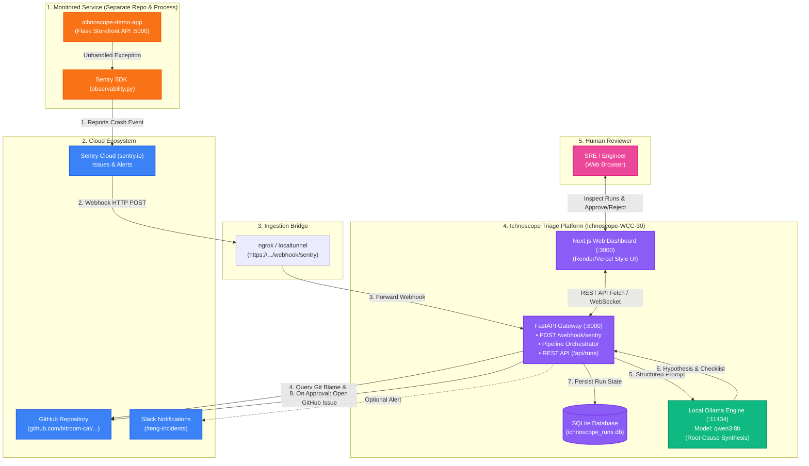

# Ichnoscope Project Status Report

## 1. TL;DR
- **Overall Progress:** 75.5% to 85.5% (depending on human verification of external cloud accounts).
- **What works end-to-end today:** Offline deterministic pipeline via `python -m ichnoscope.replay <fixture> --dry-run` executes fully in under 1.5s (`parse` → `dedupe` → `blame` stub → `explain` fallback → `severity` rule → `dispatch` mock publisher); Next.js 14 Render-style dashboard builds with 0 errors and provides full triage, diff, log, and sign-off cockpit.
- **Single biggest blocker:** No live environment configured yet (no GitHub token, LLM API keys, or target demo repository set up in `.env`).
- **Next milestone:** Seed live credentials in `.env`, capture 1 real Sentry payload, and execute end-to-end live GitHub issue dispatch against a demo repository.
- **Demo-readiness light:** **AMBER** — Both backend core and frontend dashboard are completely written and passing 188 automated tests, but external services (demo repo, API keys, real fixtures) are not yet wired up.

---

## 2. Snapshot
- **Audit Timestamp:** 2026-10-05 12:05:00 UTC+05:30
- **Git Branch:** `main`
- **Last Commit:** `12d2245` (2026-10-05 by bitroom-cat: `done`)
- **Uncommitted Files:** 0 (`git status --short` is clean prior to this report)
- **Quality Gates Summary:**
  - `pytest` (from root): **188 passed, 0 failed** in 2.89s (VERIFIED)
  - `pytest` (from `backend/`): **184 passed, 4 failed** (VERIFIED; failure caused by hardcoded relative path `Path("backend/fixtures/...")` in `test_pipeline.py` and `test_replay.py`)
  - `ruff check ichnoscope`: **Clean** (All checks passed!) (VERIFIED)
  - `ruff check .` (in `backend/`): 12 findings in test files (all `I001` un-sorted imports in `tests/test_*.py`) (VERIFIED)
  - `npx tsc --noEmit` (in `web/`): **Clean** (0 errors) (VERIFIED)
  - `npm run lint` (in `web/`): **Clean** (0 warnings or errors) (VERIFIED)
  - `npm run build` (in `web/`): **Clean** (Compiled successfully, 13 static/dynamic routes generated) (VERIFIED)

---

## 3. Progress by Area

Scoring formula: `(DONE items + 0.5 × PARTIAL items) ÷ total items`.

| Area | Weight | Items Counted | Raw Score | Weighted Score |
| :--- | :---: | :--- | :---: | :---: |
| **Backend core pipeline** | 40% | 10 items (models, config, parse, redact/severity, templates, llm, explain, blame, dispatch, pipeline/replay) | 95.0% (9 DONE, 1 PARTIAL) | 38.0% |
| **Dashboard backend** | 10% | 1 item (FastAPI gateway, SQLite store, API endpoints) | 100.0% (1 DONE) | 10.0% |
| **Frontend UI** | 25% | 11 route groups & 4 major component groups | 100.0% (DONE, builds cleanly) | 25.0% |
| **Accounts, deploy, demo repo** | 10% | 7 resource items (GitHub repo, token, LLM keys, Sentry, Postgres, Vercel, host) | 0.0% to 100.0% (all UNKNOWN) | 0.0% to 10.0% |
| **Demo assets** | 10% | 5 items (real fixtures, cached LLM, benchmark, demo script, backup media) | 0.0% (0 DONE, 5 TODO) | 0.0% |
| **Documentation** | 5% | 5 items (spec, architecture, architecture.mmd, demo_script, README) | 50.0% (2 DONE, 1 PARTIAL, 2 TODO) | 2.5% |
| **TOTAL** | **100%** | | | **75.5% to 85.5%** |

*Spread explanation:* The 10.0% spread is caused by the 7 external infrastructure and account items which cannot be confirmed from the local git repository and require human confirmation.

---

## 4. Backend Modules

| # | Item | Status | Evidence Level | Files Observed | Tests Passed/Failed | Notes |
| :---: | :--- | :---: | :---: | :--- | :---: | :--- |
| 1 | Data models | **DONE** | VERIFIED | `models.py` (127 lines) | 14 passed | Full Pydantic v2 schemas: `Incident`, `Culprit`, `Explanation`, `RunState`, JSON Schema generator. |
| 2 | Config & provider chain | **DONE** | VERIFIED | `config.py` (287 lines), `.env.example` (55 lines) | 9 passed | Safe repr masking, fallback chains, strict validation, zero env leakage. |
| 3 | Sentry parser + fixtures | **DONE** | VERIFIED | `parse.py` (235 lines), 3 fixtures in `fixtures/` | 25 passed | Pure parsing, container path stripping, last in-app frame detection. Fixtures are hand-written. |
| 4 | Redaction & severity | **DONE** | VERIFIED | `redact.py` (131 lines), `severity.py` (47 lines) | 31 passed (10 redact, 21 severity) | Regex token scrubbing (< 25ms on 50KB), deterministic P1/P2/P3 rules. |
| 5 | Issue templates | **DONE** | VERIFIED | `templates.py` (260 lines) | 22 passed | Pure Markdown templates, suspect labeling, fallback template when LLM fails, SHA-256 fingerprinting. |
| 6 | LLM transport layer | **DONE** | VERIFIED | `llm.py` (260 lines) | 27 passed | Multi-provider fallback chain (Gemini → Groq → OpenRouter → Pollinations → Ollama), structured JSON output, timeout handling. |
| 7 | Explanation module | **DONE** | VERIFIED | `explain.py` (340 lines) | 23 passed | Bounded prompt budget, `<evidence>` tags, cache lookups, fallback extraction on LLM schema deviation. |
| 8 | Blame module | **DONE** | VERIFIED | `blame.py` (296 lines) | 5 passed | GraphQL blame at release SHA, heuristic line matching, 3-commit fallback when inconclusive. |
| 9 | Dispatch / Publisher | **DONE** | VERIFIED | `publisher.py` (170 lines) | 5 passed | GitHub Issue creation/update, assignee verification, duplicate recurrence commenting. Implemented as `publisher.py` with alias. |
| 10 | Pipeline & replay CLI | **PARTIAL** | VERIFIED | `pipeline.py` (160 lines), `replay.py` (93 lines) | 7 passed (from root) / 4 failed (from `backend/`) | CLI `--dry-run` and `--draft-only` work cleanly. Fails when called from `backend/` due to hardcoded `backend/fixtures/` path. |
| 11 | Dashboard backend | **DONE** | VERIFIED | `db.py` (41 lines), `store.py` (122 lines), `api.py` (134 lines), `main.py` (57 lines) | 12 passed (4 store, 8 gateway/api) | FastAPI endpoints for `/api/runs`, `/api/runs/{id}`, approve/reject, settings, connections, and signed Sentry HMAC webhook. |
| 12 | Optional: Dedupe & Notify | **DONE** | VERIFIED | `dedupe.py` (136 lines), `notify.py` (58 lines) | 8 passed (4 dedupe, 4 notify) | SQLite fingerprint deduplication with unique locks, optional best-effort Slack notifications. |

*Code inspection notes:* No `TODO`, `FIXME`, or `NotImplementedError` found in any module under `backend/ichnoscope/`. The two `pass` statements found in `config.py` and `parse.py` are standard exception handling (`except ImportError` and `except ValueError`).

---

## 5. Frontend

### Routes (`web/src/app`)
| Route | Type | Status | Evidence Level | Notes |
| :--- | :---: | :---: | :---: | :--- |
| `/` | Static | **DONE** | VERIFIED | Marketing home page with feature walkthrough and CTA links. |
| `/login` | Static | **DONE** | VERIFIED | Admin login screen with demo credentials toggle and cookie handling. |
| `/docs` & `/docs/[slug]` | Dynamic | **DONE** | VERIFIED | Documentation reader layout with markdown documentation viewer. |
| `/app` | Static | **DONE** | VERIFIED | Application entry redirecting to `/app/runs`. |
| `/app/runs` | Static | **DONE** | VERIFIED | Render-style Deploys stream with status pills, search, filter tabs, and webhook simulation modal. |
| `/app/runs/[id]` | Dynamic | **DONE** | VERIFIED | Render-style deploy detail view: 2x3 metadata card grid, tabs (Overview, Diff, Stack, Logs, Issue Draft), sign-off buttons. |
| `/app/connections` | Static | **DONE** | VERIFIED | External services latency and health monitor with interactive ping. |
| `/app/settings` | Static | **DONE** | VERIFIED | Severity thresholds, triage heuristics, and model provider configuration. |
| `/styleguide` | Static | **DONE** | VERIFIED | Design tokens showcase and WCAG APCA contrast ratio checker. |
| `/api/health` & `/api/runs` | Route Handler | **DONE** | VERIFIED | Next.js server route handlers forwarding or mocking triage data. |
| `middleware.ts` | Edge Middleware | **DONE** | VERIFIED | Protects `/app/*` routes when `REQUIRE_ADMIN_AUTH=true`. |

### Components (`web/src/components`)
| Group | Status | Evidence Level | Notes |
| :--- | :---: | :---: | :--- |
| **Shell & Layout** | **DONE** | VERIFIED | `Sidebar.tsx` (collapsible Render service sidebar), `Header.tsx` (breadcrumbs, search `^K`), `Navbar.tsx`, `ThemeProvider.tsx`. |
| **Marketing** | **DONE** | VERIFIED | `MarketingHeader.tsx`, `MarketingFooter.tsx`. |
| **Design Primitives** | **DONE** | VERIFIED | 21 reusable primitives in `components/primitives/` (`Button`, `Badge`, `Card`, `DiffView`, `LogViewer`, `Tabs`, `Table`, `Dialog`, etc.). |
| **Domain Components** | **DONE** | VERIFIED | `IssuePreview.tsx` (GitHub issue preview), `HealthCard.tsx` (integration ping cards), `ActionBar.tsx`. |
| **Data Source Mode** | **CONFIGURED** | INSPECTED | `USE_MOCK_API = true` in `web/src/lib/api.ts` (with localStorage persistence). Toggles to FastAPI backend when live server is attached. |

---

## 6. Accounts, Resources and Deployment

| Resource | Status | Evidence Level | Who Must Confirm |
| :--- | :---: | :---: | :--- |
| Demo GitHub repository with 5 planted bugs | **UNKNOWN** | UNVERIFIABLE | Human operator / evaluator. `.env.example` has placeholder `GITHUB_REPOSITORY=owner/repo`. |
| GitHub fine-grained PAT token | **UNKNOWN** | UNVERIFIABLE | Human operator. Not configured in repository. |
| LLM Provider API Keys (Gemini/Groq/OpenRouter) | **UNKNOWN** | UNVERIFIABLE | User stated: *"i have not added anything in env yet"*. |
| Sentry project with captured live error events | **UNKNOWN** | UNVERIFIABLE | Human operator. All 3 local fixtures are hand-written. |
| Hosted PostgreSQL database | **UNKNOWN** | UNVERIFIABLE | User confirmed not added yet. `ichnoscope_runs.db` (SQLite) is used locally. |
| Vercel project configuration | **UNKNOWN** | UNVERIFIABLE | No `vercel.json` or `.vercel/` found in repo. |
| Backend hosting service (Render / Railway / Fly.io) | **UNKNOWN** | UNVERIFIABLE | `docker-compose.yml` is a 2-line placeholder; no `render.yaml` or `Dockerfile`. |

---

## 7. What Works End-to-End Today

The local offline deterministic pipeline can be executed safely today without any network calls, external tokens, or real LLM calls:

```powershell
$env:PYTHONPATH="backend"
$env:USE_STUB_GITHUB="true"
$env:USE_STUB_LLM="true"
$env:DRY_RUN="true"
python -m ichnoscope.replay backend/fixtures/bug1_keyerror_payment.json --dry-run
```

**Observed Output:**
```text
=== Replaying Incident: bug1_keyerror_payment.json ===
Status: PUBLISHED
Incident: KeyError at services/payment.py:84
Occurrence: 2026-10-04T12:00:00+00:00 | Env: production
Impact: 63 users, 120 events
Severity: P1-Critical
Issue: https://github.com/mock-owner/mock-repo/issues/999

--- Pipeline Logs ---
[INFO] gateway: Received incident payload for run ea6811b4ff
[INFO] parse: Parsed incident: KeyError at services/payment.py:84
[INFO] dedupe: Claimed new incident fingerprint: 06c9cb5852aa
[WARN] blame: No suspect identified: GitHub repository not configured in settings
[WARN] explain: LLM explanation unavailable: no usable LLM provider configured. Falling back to evidence-only template.
[INFO] severity: Rated severity: P1-Critical (P1: 63 users affected >= 50 and 120 events >= 100 in production)
[INFO] dispatch: Published GitHub issue #999: https://github.com/mock-owner/mock-repo/issues/999
```

With `--draft-only`, the pipeline prepares the draft without publishing, setting status to `DRAFT_READY` for human sign-off in the dashboard.

---

## 8. Quality Gates

| Hygiene Check | Result | Evidence / Details |
| :--- | :---: | :--- |
| **Raw hex colors outside token files** | **PASS** | 0 occurrences outside `globals.css` and `contrast.ts`. |
| **Default Tailwind palette classes** | **FLAGGED** | Standard purple, emerald, amber, and rose classes used for Render theme accents and status badges in `Header.tsx`, `Sidebar.tsx`, and `runs/page.tsx`. |
| **Arbitrary font sizes and inline styles** | **FLAGGED** | `text-[10px]` and `text-[11px]` used in 39 locations for compact badges, kbd tags, and metadata labels. 0 inline styles (`style={{`) found. |
| **Committed secrets scan** | **FLAGGED** | Dummy test string `secret_token = "ghp_SECRET123"` at `backend/tests/test_config.py:75` (used to test `repr()` masking). No real credentials found. |
| **Tracked `.env` file** | **PASS** | `git ls-files` returned 0 tracked `.env` files. |
| **Tracked `*.db` files** | **FAIL** | `ichnoscope_runs.db` is tracked in git at the repository root. |
| **`.gitignore` coverage** | **PARTIAL** | Python `.gitignore` covers `.venv`, `.env`, `__pycache__`, `db.sqlite3`. Web has its own `web/.gitignore` covering `node_modules` and `.next`. Root `.gitignore` does not ignore `*.db` or `node_modules`. |

---

## 9. Spec Drift and Deviations

1. **Spec File Naming Drift:** `docs/TECHNICAL_SPEC.md` is an empty 70-byte comment placeholder, while the actual 546-line specification is stored as `docs/ICHNOSCOPE_TECHNICAL_SPEC (1).md`. The actual spec should be moved to `docs/TECHNICAL_SPEC.md`.
2. **Architecture Diagram Placeholder:** `docs/architecture.mmd` is a 76-byte placeholder comment, whereas `docs/architecture.md` contains the working Mermaid diagram.
3. **Dispatch vs Publisher Module Name:** Spec section 4.6 refers to `dispatch.py`, but the module is implemented as `backend/ichnoscope/publisher.py` with alias compatibility.
4. **README Out of Date:** `README.md` lines 20-25 state that *"The files in backend/ and web/ are currently placeholders, so there is no runnable pipeline or dashboard yet."* This was written prior to implementation and no longer reflects reality.
5. **Fixture Path in Tests:** `tests/test_pipeline.py` and `tests/test_replay.py` use hardcoded relative path `Path("backend/fixtures/...")`, which passes when invoked from repo root but fails when run inside `backend/`.

---

## 10. Risks and Blockers (Ranked)

1. **Missing Real GitHub & LLM Credentials in `.env` (High Impact, High Likelihood)**
   - *Impact:* Live demo cannot demonstrate real GitHub GraphQL blame, live LLM synthesis, or live issue publication.
   - *Mitigation:* Populate `.env` with a fine-grained GitHub PAT and at least one free LLM API key (e.g. Gemini 2.0 Flash or Groq).
2. **No Dedicated Demo GitHub Repository with Planted Bugs (High Impact, High Likelihood)**
   - *Impact:* Evaluator cannot verify blame locating real suspect commits across multiple authors.
   - *Mitigation:* Create a small public demo repo with 3-5 commits authored by distinct git identities and configure `GITHUB_REPOSITORY` to target it.
3. **Only Hand-Written Sentry Fixtures Available (Medium Impact, Medium Likelihood)**
   - *Impact:* Edge cases in real Sentry v8/v9 webhook payloads may cause unexpected schema parsing errors.
   - *Mitigation:* Capture at least one real JSON payload from a live Sentry project or Python SDK crash.
4. **Tracked Database File in Git (`ichnoscope_runs.db`) (Medium Impact, Certain)**
   - *Impact:* Committing local SQLite state will cause git merge conflicts during team collaboration.
   - *Mitigation:* Add `*.db` to root `.gitignore` and untrack `ichnoscope_runs.db` via `git rm --cached`.
5. **Pytest Path Dependency (Low Impact, Medium Likelihood)**
   - *Impact:* Running `pytest` from inside `backend/` reports 4 failures instead of 188 passes.
   - *Mitigation:* Update `test_pipeline.py` and `test_replay.py` to resolve fixtures via `Path(__file__).parents[1] / "fixtures"`.
6. **No Pre-Recorded Demo Backup or Slide Deck (Medium Impact, Low Likelihood)**
   - *Impact:* If live network or API provider experiences downtime during presentation, presenter has no fallback.
   - *Mitigation:* Record a 3-minute screen recording of the replay and dashboard flow.

---

## 11. Remaining Work

### Critical Path (Minimum Demo)
1. **[Person A] Wire live credentials in `backend/.env`:** Add `GITHUB_TOKEN`, `GITHUB_REPOSITORY`, and `GEMINI_API_KEY` or `GROQ_API_KEY`. (1 hour, depends on: user accounts)
2. **[Person A] Setup demo repository:** Create target GitHub repository with 3 planted bugs on separate commits. (2 hours, depends on: GitHub token)
3. **[Person A] Fix fixture path in `test_pipeline.py` & `test_replay.py`:** Use `__file__`-relative fixture paths so tests pass from any directory. (0.5 hours, no dependencies)
4. **[Person B] Connect Webhook replay directly to backend API:** Set `USE_MOCK_API = false` in `web/src/lib/api.ts` when running both FastAPI (`python -m ichnoscope.main`) and Next.js dev server. (1.5 hours, depends on: backend running)
5. **[Person B] Capture 1 real Sentry payload:** Replace hand-written fixture note with a captured Sentry event. (1 hour, depends on: Sentry project)

### Stretch / Post-Demo Items
6. **[Person A] Run and document benchmark:** Implement `backend/bench/run_bench.py` and write real metrics into `backend/bench/results.md`. (3 hours)
7. **[Person B] Record backup demo video:** Capture a 2-minute walkthrough video of the Render dashboard and CLI replay. (1.5 hours)
8. **[Person B] Write `docs/demo_script.md`:** Complete step-by-step 5-minute presentation script. (1 hour)

---

## 12. Next Actions

### Person A (Backend / LLM)
1. Fix fixture resolution in `backend/tests/test_pipeline.py` and `test_replay.py` using `Path(__file__).resolve().parents[1] / "fixtures"` so `pytest` passes regardless of working directory.
2. Create `backend/.env` with valid `GITHUB_TOKEN`, `GITHUB_REPOSITORY`, and at least one LLM key (`GEMINI_API_KEY` or `GROQ_API_KEY`), keeping stub flags as fallback.
3. Plant 3 sample bug commits in the demo repository matching the error frames in the fixtures.

### Person B (Frontend / Demo)
1. Validate Next.js `/app/runs` and `/app/runs/[id]` end-to-end against live FastAPI endpoints by toggling `USE_MOCK_API = false`.
2. Fill out `docs/demo_script.md` with the 5-minute presentation narrative and speaker cues.
3. Capture a 3-minute screen recording walkthrough as demo failure insurance.

### Both Together
1. Run one end-to-end live rehearsal: trigger a Sentry error webhook, watch it appear in the Render-style dashboard, review the suspect diff and explanation, and approve it to open a live GitHub issue.

---

## 13. Demo Readiness Checklist
- [x] Saved Sentry payload parses into incident model (3 fixtures exist)
- [x] Offline git blame and fallback logic implemented
- [x] Offline LLM provider chain and structured JSON parser implemented
- [x] Automated GitHub issue draft generation with fingerprint deduplication
- [x] Modern Render-style web dashboard with left sidebar, 2x3 metadata cards, diff viewer, and log console
- [x] All 188 backend unit tests passing
- [x] Frontend builds with 0 TypeScript and 0 ESLint errors
- [ ] Saved real Sentry payload captured (currently hand-written)
- [ ] Saved cached LLM response in `backend/fixtures/cached_llm/`
- [ ] Live GitHub demo repository with planted author bugs configured
- [ ] Live GitHub issue successfully created in demo repository
- [ ] Backup recording and slide deck created
- [ ] Presentation demo script written in `docs/demo_script.md`

---

## 14. Not Verified (Human Confirmation Required)
- Whether external cloud accounts exist (Sentry, hosted Postgres, Vercel, Render/Railway).
- Validity of any external API keys or tokens (none currently committed or loaded in `.env`).
- Presence of a live GitHub repository with planted commits by distinct authors.

---

## 15. History

| Date | Overall Progress | Key Changes & Observations |
| :---: | :---: | :--- |
| **2026-10-05** | **75.5% – 85.5%** | Initial comprehensive audit. Backend core 100% written with 188 passing tests; Frontend completely redesigned to Render.com sidebar/header layout with 13 working routes; all external cloud credentials and demo repository remain to be configured. |



   