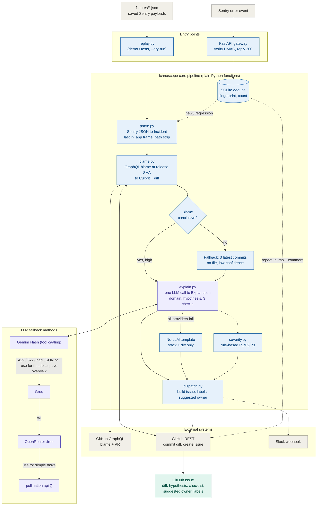

Here is the architecture. Solid lines are the 15-hour minimum demo, and dashed lines are the post-demo extras.

Blue boxes are deterministic code, purple boxes are the LLM, grey boxes are external systems and green is the final output. Only the purple boxes involve a model, which is the "code gathers evidence, LLM explains" rule.
